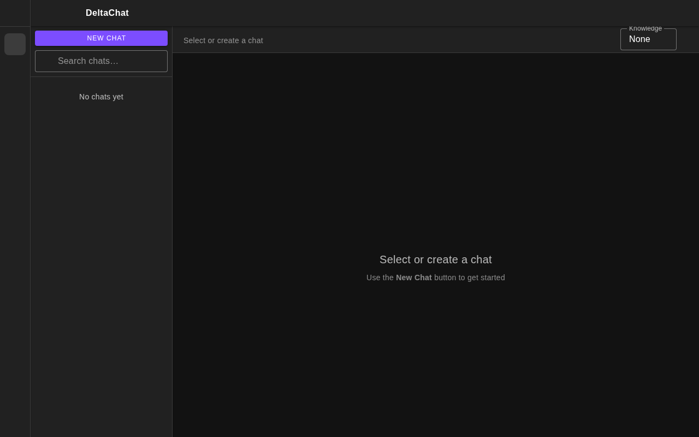
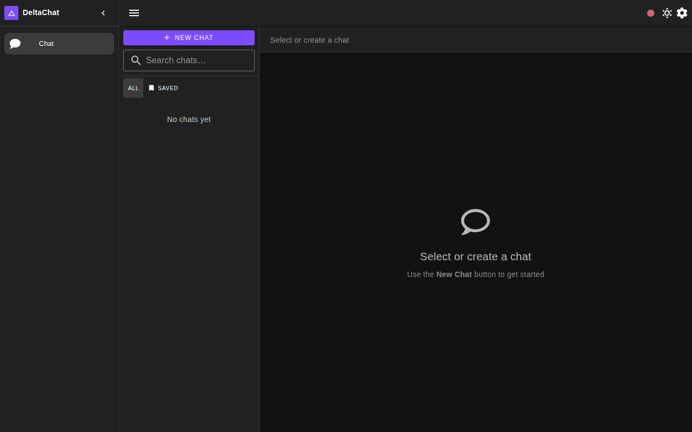
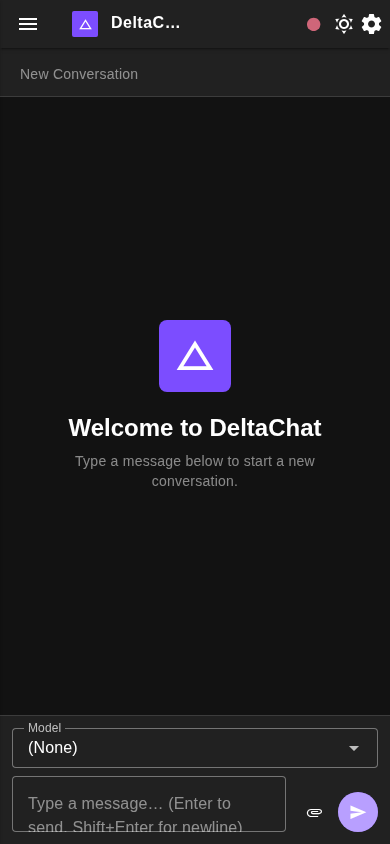
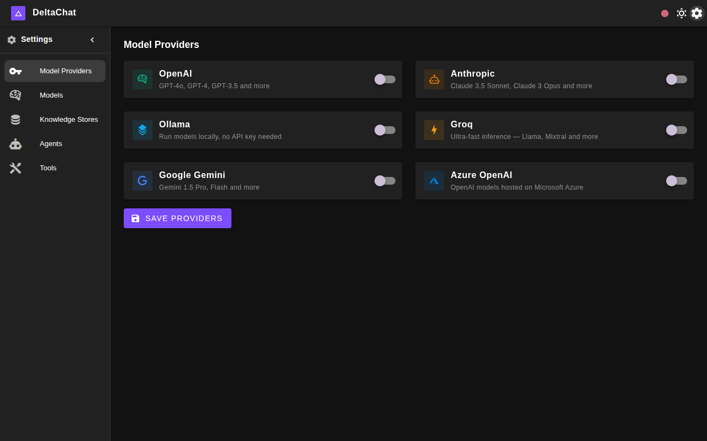
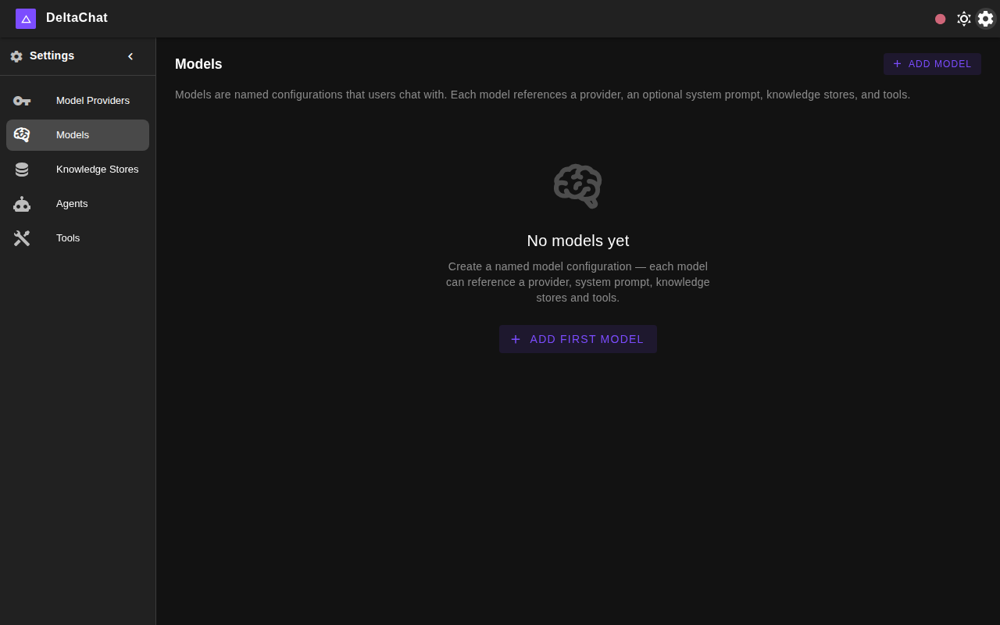
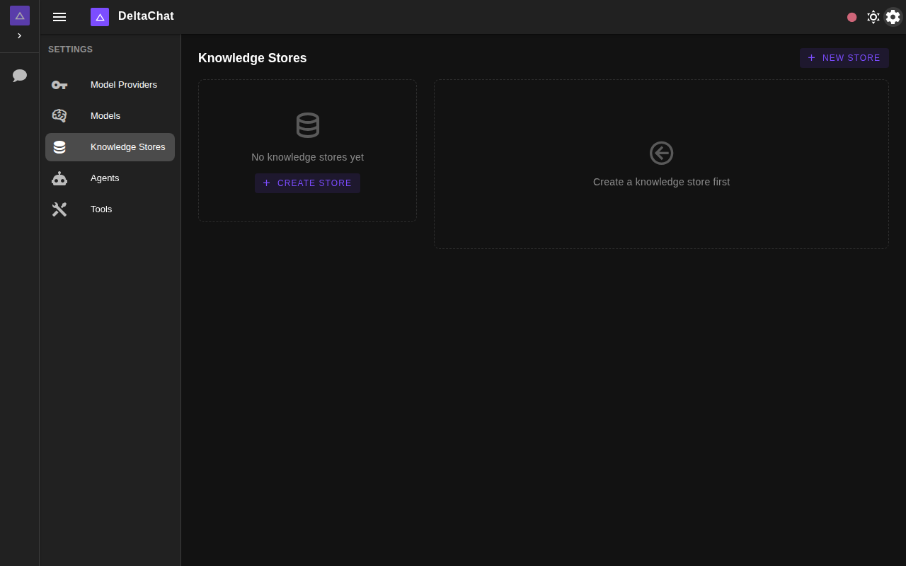
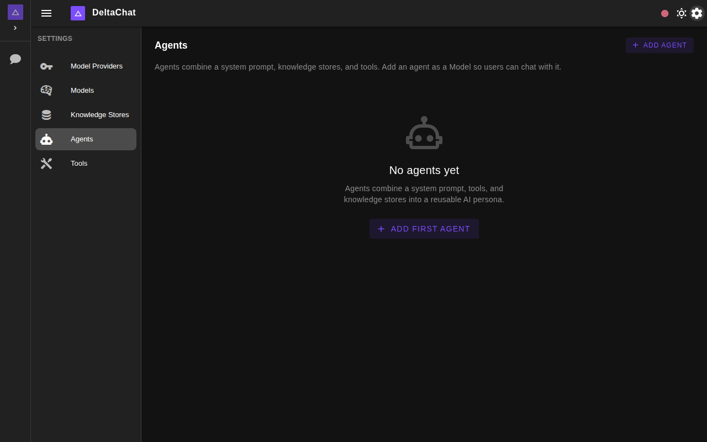
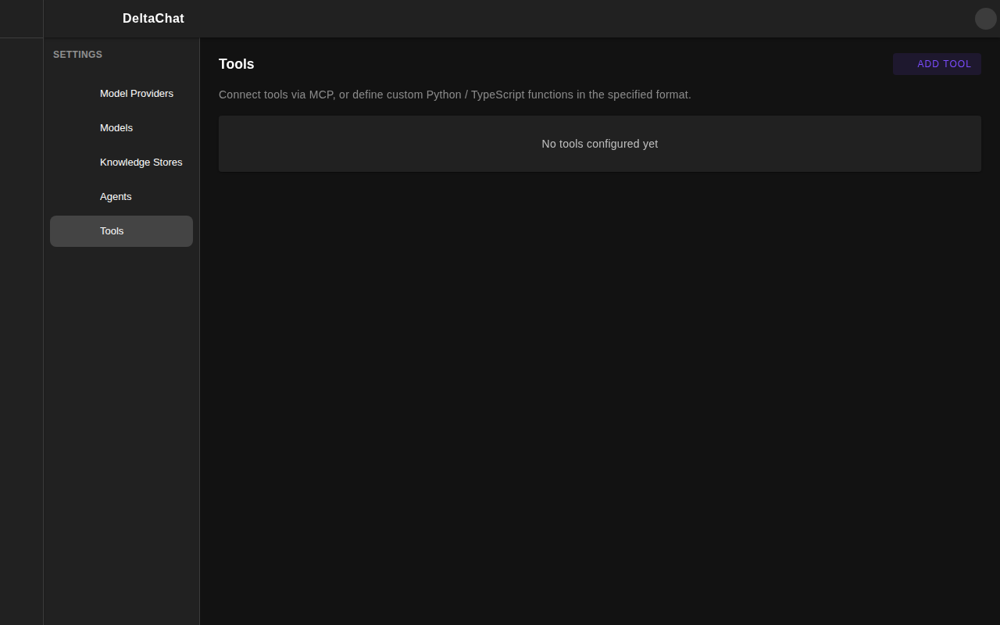

# DeltaChat

A modular, extensible AI chat interface built with **Node.js + Vue 3** using **[DeltaDatabase](https://github.com/DeltaRule/DeltaDatabase)** as the sole primary data store.

---

## Features

| Feature | Description |
|---|---|
| 💬 Real-time Chat | Streaming responses via Socket.io and SSE |
| 🧠 Multiple AI Providers | OpenAI, Google Gemini, Ollama, and more |
| 🔗 Webhook Integration | Chat with any webhook (e.g. n8n workflows) instead of an AI model |
| 📚 Knowledge Stores | Shared document repositories with RAG retrieval |
| 🔌 MCP Support | Model Context Protocol client for tool use |
| 🧩 Fully Modular | Swap any provider via plugin classes |

---

## Screenshots

### Chat View — icon-only left rail, chat sidebar with All/Saved filter


### Chat View — expanded left sidebar


### Chat View — mobile


### Settings — Model Providers


### Settings — Models (named configurations users chat with)


### Settings — Knowledge Stores


### Settings — Agents


### Settings — Tools


---

## Architecture

```
┌──────────────────────────────────────────────────────────────┐
│  Frontend  (Vue 3 + Vuetify 3, served by nginx)              │
└──────────────────┬───────────────────────────────────────────┘
                   │ REST / WebSocket
┌──────────────────▼───────────────────────────────────────────┐
│  Backend  (Node.js / Express + Socket.io)                    │
│                                                              │
│  ┌───────────────────────────────────────────────────────┐   │
│  │  Module System (swap any implementation)              │   │
│  │  • ModelProvider   (OpenAI / Gemini / Webhook / …)    │   │
│  │  • EmbeddingProvider (OpenAI / Ollama / …)            │   │
│  │  • BinaryProcessor (Tika / Docling / …)               │   │
│  │  • BinaryStorage   (Local / S3 / …)                   │   │
│  │  • VectorStore     (Chroma / Qdrant / …)              │   │
│  │  • FunctionExecutor (Docker / Local / …)              │   │
│  └───────────────────────────────────────────────────────┘   │
└──────────────────┬─────────────────────────┬─────────────────┘
                   │                         │
     ┌─────────────▼───────────┐   ┌─────────▼───────────┐
     │  DeltaDatabase          │   │  ChromaDB            │
     │  (primary data store)   │   │  (vector store)      │
     └─────────────────────────┘   └─────────────────────┘
```

### Module base classes

Every module has an abstract base class and one or more concrete implementations.
To add a new provider, extend the base class and register it in the service.

| Module | Base class | Implementations |
|---|---|---|
| `ModelProvider` | `ModelProviderBase` | `OpenAIProvider`, `GeminiProvider`, `WebhookProvider` |
| `EmbeddingProvider` | `EmbeddingProviderBase` | `OpenAIEmbedding`, `OllamaEmbedding` |
| `BinaryProcessor` | `BinaryProcessorBase` | `TikaProcessor`, `DoclingProcessor` |
| `BinaryStorage` | `BinaryStorageBase` | `LocalBinaryStorage` |
| `VectorStore` | `VectorStoreBase` | `ChromaVectorStore` |
| `FunctionExecutor` | `FunctionExecutorBase` | `LocalExecutor`, `DockerExecutor` |

---

## Quick Start (Docker Compose)

### 1. Copy and configure environment

```bash
cp .env.example .env
# Edit .env – set at minimum:
#   DELTA_DB_ADMIN_KEY  (matches ADMIN_KEY in docker-compose)
#   OPENAI_API_KEY      (or another model provider key)
```

### 2. Start all services

```bash
docker compose up -d
```

| Service | URL |
|---|---|
| DeltaDatabase | http://localhost:8080 |
| ChromaDB | http://localhost:8001 |
| Backend API | http://localhost:3000 |
| Frontend | http://localhost:80 |

### 3. Open the app

Navigate to **http://localhost** in your browser.

---

## Local Development (without Docker)

### Prerequisites

- Node.js ≥ 18
- Docker (for DeltaDatabase, ChromaDB, and Tika)

### 1. Start data services

```bash
# DeltaDatabase
docker run -d --name deltadatabase -p 8080:8080 -e ADMIN_KEY=secretkey \
  donti/deltadatabase:latest-aio

# ChromaDB
docker run -d -p 8001:8000 chromadb/chroma

# Apache Tika (optional, for document processing)
docker run -d -p 9998:9998 apache/tika:latest-full
```

### 2. Backend

```bash
cd backend
cp .env.example .env
# Set DELTA_DB_URL=http://127.0.0.1:8080 and DELTA_DB_ADMIN_KEY=mysecretadminkey
npm install
npm run dev
```

### 3. Frontend

```bash
cd frontend
cp .env.example .env
npm install
npm run dev
```

Open **http://localhost:5173**.

---

## DeltaDatabase Integration

DeltaDatabase is the **only** primary data store (besides the vector store).  
It is a lightweight REST key-value service:

```
PUT /entity/{database}   { key: doc, … }   # upsert entities
GET /entity/{database}?key={k}             # fetch by key
POST /api/login          { key: adminKey } # get Bearer token
```

Start DeltaDatabase with Docker:

```bash
docker run -d \
  --name deltadatabase \
  -p 8080:8080 \
  -e ADMIN_KEY=mysecretadminkey \
  -v delta_data:/shared/db \
  donti/deltadatabase:latest-aio
```

> ⚠ `DELTA_DB_URL` is **required** — the application will not start without it.

Since DeltaDatabase has no native list/delete/query, the adapter (`backend/src/db/DeltaDatabaseAdapter.js`) maintains:

- **Master index** (`{col}:_index`) — list of all entity IDs per collection
- **Secondary indexes** (`{col}:_idx:{field}:{value}`) — e.g. messages by chatId
- **Soft deletes** — entities are marked `_deleted: true` and pruned from indexes

### Collections

| Collection | Key pattern | Secondary indexes |
|---|---|---|
| `chats` | `chats:{id}` | — |
| `messages` | `messages:{id}` | `messages:_idx:chatId:{chatId}` |
| `knowledge_stores` | `knowledge_stores:{id}` | — |
| `documents` | `documents:{id}` | `documents:_idx:knowledgeStoreId:{id}` |
| `webhooks` | `webhooks:{id}` | — |
| `settings` | `settings:global` | — |

---

## Webhook Integration

Instead of an AI model, you can configure a webhook URL as the "model" for a chat.
The backend will POST the conversation to the webhook and use the response as the assistant message.

This enables integration with tools like **n8n**, **Make**, **Zapier**, or any custom HTTP endpoint.

**Payload sent to the webhook:**
```json
{
  "chatId": "abc123",
  "messages": [
    { "role": "user", "content": "Hello!" }
  ],
  "metadata": { "chatTitle": "My Chat" }
}
```

**Expected response:**
```json
{ "content": "Hello! How can I help?" }
```

---

## MCP (Model Context Protocol)

Configure an MCP server URL in Settings.  The backend MCP service:
- Connects to the MCP server
- Lists available tools
- Injects tool definitions into the system prompt / function-calling

---

## API Reference

### Chat

| Method | Endpoint | Description |
|---|---|---|
| GET | `/api/chats` | List all chats |
| POST | `/api/chats` | Create chat |
| GET | `/api/chats/:id` | Get chat with messages |
| DELETE | `/api/chats/:id` | Delete chat |
| POST | `/api/chats/:id/messages` | Send message (streaming via SSE) |

### Knowledge Stores

| Method | Endpoint | Description |
|---|---|---|
| GET | `/api/knowledge-stores` | List stores |
| POST | `/api/knowledge-stores` | Create store |
| DELETE | `/api/knowledge-stores/:id` | Delete store |
| POST | `/api/knowledge-stores/:id/documents` | Upload document |
| GET | `/api/knowledge-stores/:id/documents` | List documents |
| DELETE | `/api/knowledge-stores/:id/documents/:docId` | Delete document |

### Webhooks

| Method | Endpoint | Description |
|---|---|---|
| GET | `/api/webhooks` | List webhooks |
| POST | `/api/webhooks` | Register webhook |
| PUT | `/api/webhooks/:id` | Update webhook |
| DELETE | `/api/webhooks/:id` | Delete webhook |

### Settings & Providers

| Method | Endpoint | Description |
|---|---|---|
| GET | `/api/settings` | Get settings |
| PUT | `/api/settings` | Update settings |
| GET | `/api/providers` | List available providers |
| POST | `/api/mcp/tools` | List MCP tools |
| POST | `/api/mcp/call` | Call MCP tool |

### Models (named AI configurations)

| Method | Endpoint | Description |
|---|---|---|
| GET | `/api/models` | List named model configs |
| POST | `/api/models` | Create model config |
| GET | `/api/models/:id` | Get model config |
| PUT | `/api/models/:id` | Update model config |
| DELETE | `/api/models/:id` | Delete model config |

### Agents

| Method | Endpoint | Description |
|---|---|---|
| GET | `/api/agents` | List agents |
| POST | `/api/agents` | Create agent |
| GET | `/api/agents/:id` | Get agent |
| PUT | `/api/agents/:id` | Update agent |
| DELETE | `/api/agents/:id` | Delete agent |

### Tools

| Method | Endpoint | Description |
|---|---|---|
| GET | `/api/tools` | List tools |
| POST | `/api/tools` | Create tool |
| GET | `/api/tools/:id` | Get tool |
| PUT | `/api/tools/:id` | Update tool |
| DELETE | `/api/tools/:id` | Delete tool |

---

## Project Structure

```
DeltaChat/
├── docker-compose.yml
├── .env.example
├── backend/
│   ├── Dockerfile
│   ├── package.json
│   └── src/
│       ├── server.js            # Entry point + Socket.io
│       ├── app.js               # Express app
│       ├── config/index.js      # Config from env vars
│       ├── db/
│       │   └── DeltaDatabaseAdapter.js  # DeltaDatabase client + CRUD adapter
│       ├── modules/
│       │   ├── ModelProvider/
│       │   ├── EmbeddingProvider/
│       │   ├── BinaryProcessor/
│       │   ├── BinaryStorage/
│       │   ├── VectorStore/
│       │   └── FunctionExecutor/
│       ├── services/
│       │   ├── ChatService.js
│       │   ├── KnowledgeService.js
│       │   ├── WebhookService.js
│       │   └── McpService.js
│       └── routes/
│           ├── chat.js
│           ├── knowledge.js
│           ├── webhooks.js
│           ├── settings.js
│           └── mcp.js
└── frontend/
    ├── Dockerfile
    ├── nginx.conf
    ├── package.json
    ├── vite.config.js
    └── src/
        ├── main.js
        ├── App.vue
        ├── router/index.js
        ├── stores/
        │   ├── chat.js
        │   ├── knowledge.js
        │   └── settings.js
        ├── components/
        │   ├── AppNavigation.vue
        │   ├── ChatInterface.vue
        │   ├── ChatMessage.vue
        │   ├── KnowledgeStores.vue
        │   └── SettingsPanel.vue
        └── views/
            ├── ChatView.vue
            ├── KnowledgeView.vue
            └── SettingsView.vue
```

---

## License

MIT
