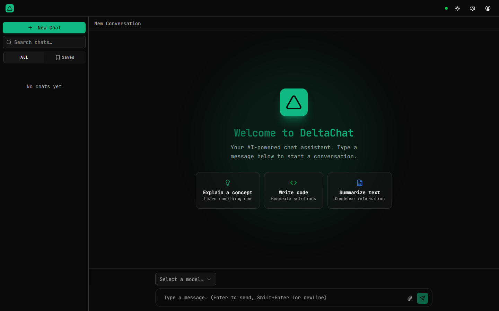
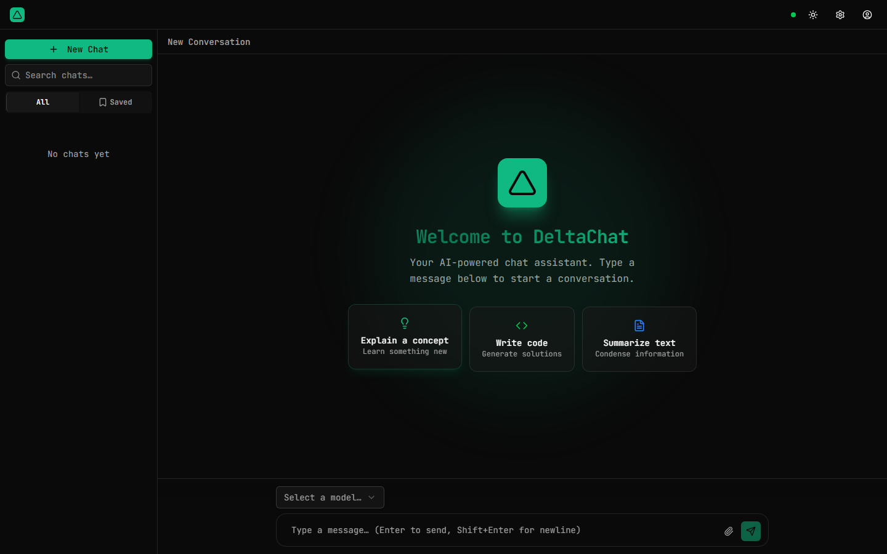
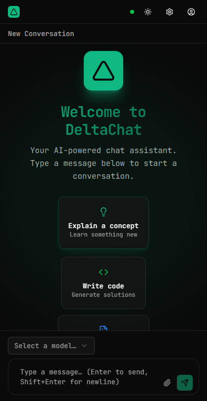
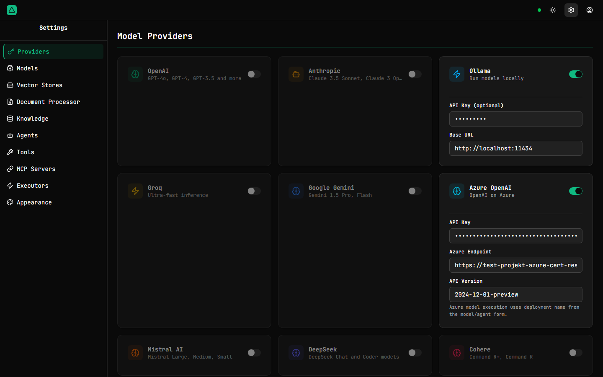
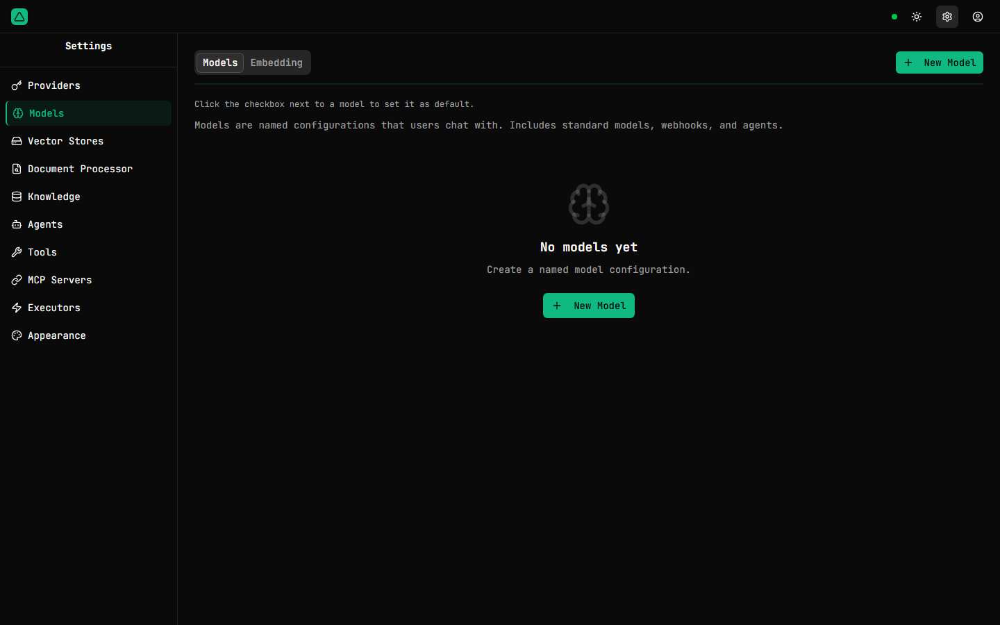
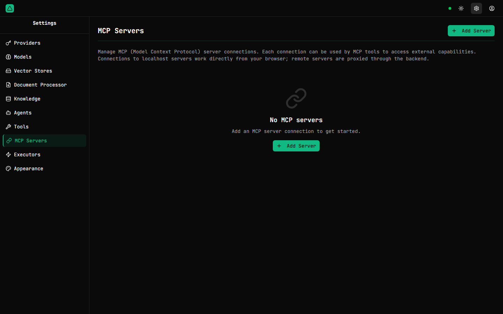

# DeltaChat

A modular, extensible AI chat interface built with **Node.js + Vue 3** using **[DeltaDatabase](https://github.com/DeltaRule/DeltaDatabase)** as the sole primary data store.

---

## Features

| Feature                  | Description                                                                                    |
| ------------------------ | ---------------------------------------------------------------------------------------------- |
| 💬 Real-time Chat        | Streaming responses via Socket.io and SSE                                                      |
| 🧠 Multiple AI Providers | OpenAI, Anthropic, Google Gemini, Ollama, DeepSeek, Groq, and more                             |
| 🔗 Webhook Integration   | Chat with any webhook (e.g. n8n workflows) instead of an AI model                              |
| 📚 Knowledge Stores      | Shared document repositories with RAG retrieval                                                |
| 🔌 MCP Support           | Per-user MCP server connections stored in DB with browser-direct + backend-proxy CORS handling |
| 🛠️ Executable Tools      | MCP, Python, and TypeScript tools with sandboxed execution                                     |
| 🔒 Auth & SCIM           | JWT authentication, SCIM user provisioning, user groups                                        |
| 🤝 Chat Sharing          | Share chats with other users or groups                                                         |
| 🧩 Fully Modular         | Swap any provider via plugin classes                                                           |

---

## Screenshots

### Chat View — collapsed sidebar (logo + `+` icon only)



### Chat View — expanded sidebar (logo, New Chat button, search, chat list)



### Chat View — mobile



### Settings — expanded sidebar (icon + text, active highlight)


### Settings — collapsed sidebar (icons only with active indicator)



### Settings — Models (named configurations users chat with)



### Settings — MCP Servers (per-user MCP connections)



---

## Architecture

```
┌──────────────────────────────────────────────────────────────┐
│  Frontend  (Vue 3 + ShadCN UI, served by nginx)             │
└──────────────────┬───────────────────────────────────────────┘
                   │ REST / WebSocket
┌──────────────────▼───────────────────────────────────────────┐
│  Backend  (Node.js / Express + Socket.io)                    │
│                                                              │
│  ┌───────────────────────────────────────────────────────┐   │
│  │  Module System (swap any implementation)              │   │
│  │  • ModelProvider   (OpenAI / Gemini / Webhook / …)    │   │
│  │  • EmbeddingProvider (OpenAI / Ollama / …)            │   │
│  │  • BinaryProcessor (Tika / Docling / …)               │   │
│  │  • BinaryStorage   (Local / S3 / …)                   │   │
│  │  • VectorStore     (Chroma / Qdrant / …)              │   │
│  │  • FunctionExecutor (Docker / Local / …)              │   │
│  └───────────────────────────────────────────────────────┘   │
└──────────────────┬─────────────────────────┬─────────────────┘
                   │                         │
     ┌─────────────▼───────────┐   ┌─────────▼───────────┐
     │  DeltaDatabase          │   │  ChromaDB            │
     │  (primary data store)   │   │  (vector store)      │
     └─────────────────────────┘   └─────────────────────┘
```

### Module base classes

Every module has an abstract base class and one or more concrete implementations.
To add a new provider, extend the base class and register it in the service.

| Module              | Base class              | Implementations                                                                                                                                                                              |
| ------------------- | ----------------------- | -------------------------------------------------------------------------------------------------------------------------------------------------------------------------------------------- |
| `ModelProvider`     | `ModelProviderBase`     | `OpenAIProvider`, `AnthropicProvider`, `GeminiProvider`, `OllamaProvider`, `DeepSeekProvider`, `GroqProvider`, `MistralProvider`, `CohereProvider`, `AzureOpenAIProvider`, `WebhookProvider` |
| `EmbeddingProvider` | `EmbeddingProviderBase` | `OpenAIEmbedding`, `OllamaEmbedding`, `GeminiEmbedding`, `MistralEmbedding`, `CohereEmbedding`, `HuggingFaceEmbedding`, `AzureOpenAIEmbedding`                                               |
| `BinaryProcessor`   | `BinaryProcessorBase`   | `TikaProcessor`, `DoclingProcessor`, `LangChainProcessor`, `UnstructuredProcessor`                                                                                                           |
| `BinaryStorage`     | `BinaryStorageBase`     | `LocalBinaryStorage`, `S3BinaryStorage`, `AzureBlobStorage`, `GCSBinaryStorage`                                                                                                              |
| `VectorStore`       | `VectorStoreBase`       | `ChromaVectorStore`, `LocalVectorStore`, `QdrantVectorStore`, `PineconeVectorStore`, `MilvusVectorStore`, `PgVectorStore`, `WeaviateVectorStore`                                             |
| `FunctionExecutor`  | `FunctionExecutorBase`  | `PythonExecutor`, `TypeScriptExecutor`                                                                                                                                                       |

---

## Quick Start (Docker Compose)

### 1. Copy and configure environment

```bash
cp .env.example .env
# Edit .env – set at minimum:
#   DELTA_DB_ADMIN_KEY  (matches ADMIN_KEY in docker-compose)
#   OPENAI_API_KEY      (or another model provider key)
```

### 2. Start all services

```bash
docker compose up -d
```

| Service       | URL                   |
| ------------- | --------------------- |
| DeltaDatabase | http://localhost:8080 |
| ChromaDB      | http://localhost:8001 |
| Backend API   | http://localhost:3000 |
| Frontend      | http://localhost:80   |

### 3. Open the app

Navigate to **http://localhost** in your browser.

---

## Local Development (without Docker)

### Prerequisites

- Node.js ≥ 18
- Docker (for DeltaDatabase, ChromaDB, and Tika)

### 1. Start data services

```bash
# DeltaDatabase
docker run -d --name deltadatabase -p 8080:8080 -e ADMIN_KEY=secretkey \
  donti/deltadatabase:latest-aio

# ChromaDB
docker run -d -p 8001:8000 chromadb/chroma

# Apache Tika (optional, for document processing)
docker run -d -p 9998:9998 apache/tika:latest-full
```

### 2. Backend

```bash
cd backend
cp .env.example .env
# Set DELTA_DB_URL=http://127.0.0.1:8080 and DELTA_DB_ADMIN_KEY=mysecretadminkey
npm install
npm run dev
```

### 3. Frontend

```bash
cd frontend
cp .env.example .env
npm install
npm run dev
```

Open **http://localhost:5173**.

---

## DeltaDatabase Integration

DeltaDatabase is the **only** primary data store (besides the vector store).
It is a lightweight REST key-value service:

```
PUT /entity/{database}   { key: doc, … }   # upsert entities
GET /entity/{database}?key={k}             # fetch by key
POST /api/login          { key: adminKey } # get Bearer token
```

Start DeltaDatabase with Docker:

```bash
docker run -d \
  --name deltadatabase \
  -p 8080:8080 \
  -e ADMIN_KEY=mysecretadminkey \
  -v delta_data:/shared/db \
  donti/deltadatabase:latest-aio
```

> ⚠ `DELTA_DB_URL` is **required** — the application will not start without it.

Since DeltaDatabase has no native list/delete/query, the adapter (`backend/src/db/DeltaDatabaseAdapter.ts`) maintains:

- **Master index** (`{col}:_index`) — list of all entity IDs per collection
- **Secondary indexes** (`{col}:_idx:{field}:{value}`) — e.g. messages by chatId
- **Soft deletes** — entities are marked `_deleted: true` and pruned from indexes

### Collections

| Collection         | Key pattern             | Secondary indexes                      |
| ------------------ | ----------------------- | -------------------------------------- |
| `chats`            | `chats:{id}`            | —                                      |
| `messages`         | `messages:{id}`         | `messages:_idx:chatId:{chatId}`        |
| `knowledge_stores` | `knowledge_stores:{id}` | —                                      |
| `documents`        | `documents:{id}`        | `documents:_idx:knowledgeStoreId:{id}` |
| `webhooks`         | `webhooks:{id}`         | —                                      |
| `models`           | `models:{id}`           | —                                      |
| `agents`           | `agents:{id}`           | —                                      |
| `tools`            | `tools:{id}`            | —                                      |
| `mcp_connections`  | `mcp_connections:{id}`  | —                                      |
| `users`            | `users:{id}`            | —                                      |
| `user_groups`      | `user_groups:{id}`      | —                                      |
| `sharing_rules`    | `sharing_rules:{id}`    | `sharing_rules:_idx:chatId:{chatId}`   |
| `settings`         | `settings:global`       | —                                      |

---

## Webhook Integration

Instead of an AI model, you can configure a webhook URL as the "model" for a chat.
The backend will POST the conversation to the webhook and use the response as the assistant message.

This enables integration with tools like **n8n**, **Make**, **Zapier**, or any custom HTTP endpoint.

**Payload sent to the webhook:**

```json
{
  "chatId": "abc123",
  "messages": [{ "role": "user", "content": "Hello!" }],
  "metadata": { "chatTitle": "My Chat" }
}
```

**Expected response:**

```json
{ "content": "Hello! How can I help?" }
```

---

## MCP (Model Context Protocol)

MCP server connections are stored **per user** in DeltaDatabase. Users manage their connections in **Settings → MCP Servers**.

### How it works

1. **Frontend management** — Add/edit/test MCP server connections from the Settings UI. Tests go directly from the browser to the MCP server URL.
2. **CORS handling** — If the browser cannot reach the MCP server directly (CORS), requests fall back to the backend proxy (`POST /api/mcp/proxy`).
3. **Chat-time execution** — During chat, MCP tool calls are executed server-side via `ToolExecutionService`, which looks up the connection URL from the database.

### API endpoints

| Method | Endpoint                   | Description                          |
| ------ | -------------------------- | ------------------------------------ |
| GET    | `/api/mcp-connections`     | List user's MCP connections          |
| POST   | `/api/mcp-connections`     | Create MCP connection                |
| GET    | `/api/mcp-connections/:id` | Get connection                       |
| PUT    | `/api/mcp-connections/:id` | Update connection                    |
| DELETE | `/api/mcp-connections/:id` | Delete connection                    |
| POST   | `/api/mcp/proxy`           | Proxy JSON-RPC request to MCP server |
| POST   | `/api/mcp/tools`           | List tools from default MCP server   |
| POST   | `/api/mcp/call`            | Call tool on default MCP server      |

---

## API Reference

### Chat

| Method | Endpoint                  | Description                      |
| ------ | ------------------------- | -------------------------------- |
| GET    | `/api/chats`              | List all chats                   |
| POST   | `/api/chats`              | Create chat                      |
| GET    | `/api/chats/:id`          | Get chat with messages           |
| DELETE | `/api/chats/:id`          | Delete chat                      |
| POST   | `/api/chats/:id/messages` | Send message (streaming via SSE) |

### Knowledge Stores

| Method | Endpoint                                     | Description     |
| ------ | -------------------------------------------- | --------------- |
| GET    | `/api/knowledge-stores`                      | List stores     |
| POST   | `/api/knowledge-stores`                      | Create store    |
| DELETE | `/api/knowledge-stores/:id`                  | Delete store    |
| POST   | `/api/knowledge-stores/:id/documents`        | Upload document |
| GET    | `/api/knowledge-stores/:id/documents`        | List documents  |
| DELETE | `/api/knowledge-stores/:id/documents/:docId` | Delete document |

### Webhooks

| Method | Endpoint            | Description      |
| ------ | ------------------- | ---------------- |
| GET    | `/api/webhooks`     | List webhooks    |
| POST   | `/api/webhooks`     | Register webhook |
| PUT    | `/api/webhooks/:id` | Update webhook   |
| DELETE | `/api/webhooks/:id` | Delete webhook   |

### Settings & Providers

| Method | Endpoint         | Description              |
| ------ | ---------------- | ------------------------ |
| GET    | `/api/settings`  | Get settings             |
| PUT    | `/api/settings`  | Update settings          |
| GET    | `/api/providers` | List available providers |

### MCP Connections

| Method | Endpoint                   | Description                  |
| ------ | -------------------------- | ---------------------------- |
| GET    | `/api/mcp-connections`     | List MCP connections         |
| POST   | `/api/mcp-connections`     | Create MCP connection        |
| GET    | `/api/mcp-connections/:id` | Get connection               |
| PUT    | `/api/mcp-connections/:id` | Update connection            |
| DELETE | `/api/mcp-connections/:id` | Delete connection            |
| POST   | `/api/mcp/proxy`           | Proxy JSON-RPC to MCP server |
| POST   | `/api/mcp/tools`           | List MCP tools               |
| POST   | `/api/mcp/call`            | Call MCP tool                |

### Auth & Users

| Method | Endpoint               | Description         |
| ------ | ---------------------- | ------------------- |
| POST   | `/api/auth/login`      | Login               |
| GET    | `/api/auth/me`         | Current user        |
| GET    | `/api/users`           | List users (admin)  |
| POST   | `/api/users`           | Create user (admin) |
| PUT    | `/api/users/:id`       | Update user (admin) |
| DELETE | `/api/users/:id`       | Delete user (admin) |
| GET    | `/api/user-groups`     | List user groups    |
| POST   | `/api/user-groups`     | Create user group   |
| PUT    | `/api/user-groups/:id` | Update user group   |
| DELETE | `/api/user-groups/:id` | Delete user group   |

### Sharing

| Method | Endpoint                      | Description       |
| ------ | ----------------------------- | ----------------- |
| GET    | `/api/sharing/chat/:id`       | Get sharing rules |
| PUT    | `/api/sharing/chat/:id`       | Set sharing rules |
| GET    | `/api/sharing/shared-with-me` | Shared chat list  |

### Models (named AI configurations)

| Method | Endpoint          | Description              |
| ------ | ----------------- | ------------------------ |
| GET    | `/api/models`     | List named model configs |
| POST   | `/api/models`     | Create model config      |
| GET    | `/api/models/:id` | Get model config         |
| PUT    | `/api/models/:id` | Update model config      |
| DELETE | `/api/models/:id` | Delete model config      |

### Agents

| Method | Endpoint          | Description  |
| ------ | ----------------- | ------------ |
| GET    | `/api/agents`     | List agents  |
| POST   | `/api/agents`     | Create agent |
| GET    | `/api/agents/:id` | Get agent    |
| PUT    | `/api/agents/:id` | Update agent |
| DELETE | `/api/agents/:id` | Delete agent |

### Tools

| Method | Endpoint         | Description |
| ------ | ---------------- | ----------- |
| GET    | `/api/tools`     | List tools  |
| POST   | `/api/tools`     | Create tool |
| GET    | `/api/tools/:id` | Get tool    |
| PUT    | `/api/tools/:id` | Update tool |
| DELETE | `/api/tools/:id` | Delete tool |

---

## Project Structure

```
DeltaChat/
├── docker-compose.yml
├── .env.example
├── backend/
│   ├── Dockerfile
│   ├── package.json
│   └── src/
│       ├── server.ts            # Entry point + Socket.io
│       ├── app.ts               # Express app
│       ├── config/index.ts      # Config from env vars
│       ├── db/
│       │   ├── DeltaDatabaseAdapter.ts  # DeltaDatabase client + CRUD adapter
│       │   └── schema.ts               # Collection schemas & validation
│       ├── middleware/
│       │   └── auth.ts          # JWT auth middleware
│       ├── modules/
│       │   ├── ModelProvider/    # OpenAI, Anthropic, Gemini, Ollama, DeepSeek, Groq, Mistral, Cohere, Azure, Webhook
│       │   ├── EmbeddingProvider/
│       │   ├── BinaryProcessor/ # Tika, Docling, LangChain, Unstructured
│       │   ├── BinaryStorage/   # Local, S3, Azure, GCS
│       │   ├── VectorStore/     # Chroma, Local, Qdrant, Pinecone, Milvus, PgVector, Weaviate
│       │   └── FunctionExecutor/ # Python, TypeScript
│       ├── services/
│       │   ├── AuthService.ts
│       │   ├── ChatService.ts
│       │   ├── KnowledgeService.ts
│       │   ├── McpService.ts
│       │   ├── SharingService.ts
│       │   ├── ToolExecutionService.ts
│       │   └── WebhookService.ts
│       └── routes/
│           ├── agents.ts
│           ├── auth.ts
│           ├── chat.ts
│           ├── knowledge.ts
│           ├── mcp.ts
│           ├── mcpConnections.ts
│           ├── models.ts
│           ├── scim.ts
│           ├── settings.ts
│           ├── sharing.ts
│           ├── tools.ts
│           ├── user-groups.ts
│           ├── users.ts
│           └── webhooks.ts
└── frontend/
    ├── Dockerfile
    ├── nginx.conf
    ├── package.json
    ├── vite.config.ts
    └── src/
        ├── main.ts
        ├── App.vue
        ├── router/index.ts
        ├── lib/
        │   ├── api.ts           # Axios API client
        │   └── mcpClient.ts     # Browser-side MCP JSON-RPC client
        ├── stores/
        │   ├── agents.ts
        │   ├── auth.ts
        │   ├── chat.ts
        │   ├── knowledge.ts
        │   ├── mcpConnections.ts
        │   ├── models.ts
        │   ├── notification.ts
        │   ├── settings.ts
        │   ├── sharing.ts
        │   ├── theme.ts
        │   ├── tools.ts
        │   ├── userGroups.ts
        │   └── users.ts
        ├── components/
        │   ├── AppNavigation.vue
        │   ├── ChatInterface.vue
        │   ├── ChatMessage.vue
        │   ├── KnowledgeStores.vue
        │   ├── SettingsPanel.vue
        │   ├── ShareDialog.vue
        │   └── ui/              # ShadCN-vue component library
        └── views/
            ├── AdminView.vue
            ├── ChatView.vue
            ├── KnowledgeView.vue
            ├── LoginView.vue
            └── SettingsView.vue
```

---

## License

MIT
